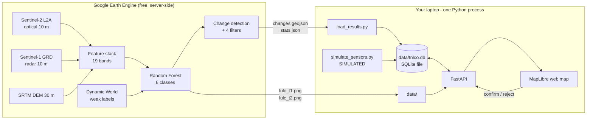

# TN-LCO — One-Day Prototype Build Guide

**Full name:** Tamil Nadu District Land-Change Observatory (prototype)
**Derived from:** TNSLURB 2026-27 proposal — "One Tamil Nadu Geo-AI Platform"
**Builder:** one person. **Time:** one working day. **Budget:** zero.
**Runtime:** laptop with Python only, plus a Google Earth Engine account.
**No Docker. No database server. Nothing to install beyond two Python packages.**

---

## 0. Read this before you write any code

### 0.1 What you are proving

You are **not** building the platform in the proposal. You are building the smallest
thing that proves the platform is possible. One sentence, and this is the sentence
you will say in the demo:

> Using only free satellite data and free compute, this prototype classifies land
> cover in a Tamil Nadu study area at two dates seven years apart, detects where the
> land actually changed, removes seasonal false alarms using a cross-season
> persistence test and ground moisture context, stores the result in a spatial
> database, and serves it as a working web map with priority alerts and a field
> verification loop.

If a reviewer asks "is the big project doable?", every hard part of the answer is
in that sentence: free data works, the ML works, the filtering works, the database
works, the map works, the alert loop closes. Scaling from one window to 38 districts
is then an engineering and funding question, not a research question. **That is the
argument you are making.**

### 0.2 Four changes I made to the proposal, and why

| Proposal says | Prototype does | Why |
|---|---|---|
| Real-time monitoring | **Two dated epochs, compared** | Satellites are not real-time. Sentinel-2 revisits every 5 days and cloud removes most of that. Calling it real-time is the fastest way to lose a technical reviewer. Use "periodic" and "near-real-time at 5-day nominal revisit". |
| Train U-Net / ViT / Swin / SAM | **Random Forest in Earth Engine** | You have one day and no labelled data. A Random Forest on spectral + radar + terrain features gives a real confusion matrix today. The deep model is a Month-2 upgrade, and it must beat this baseline or it does not go in the paper. |
| Detect encroachment / unauthorised land use | **Detect land-cover change, rank for verification** | Legality needs cadastral parcels, ownership records and approved land-use zoning. You have none of them and will not get them in a day. Detecting change is honest. Calling it encroachment is not. |
| IoT sensors deployed in pilot districts | **Simulated sensor stream, labelled SIMULATED in the UI** | Zero budget, no hardware. The simulation is generated from a real Tamil Nadu bimodal rainfall model, and it drives a real decision rule. Every screen says SIMULATED. Declaring this costs you nothing; hiding it destroys the project in review. |

**One thing I added that is not in the proposal:** the **cross-season persistence
filter**. A change is only kept if it is still present in an independent second
season. This is what separates real land conversion from crop cycles. It is cheap,
it is measurable, and it is the most defensible novel claim you have. See §5.

### 0.3 Prerequisites — do these before the day starts (20 minutes)

1. **Earth Engine project.** A student account is not enough by itself. Go to
   `code.earthengine.google.com`, and register a Google Cloud project for
   **noncommercial / academic** use. Note the project ID. You will pass it to
   `ee.Initialize(project='...')`. **This is the single most common blocker.**
   Do it the night before, not at 9 a.m.
2. **Python 3.11+** with a virtual environment. That is the whole toolchain.
   The database is SQLite, which ships inside Python — there is no server, no
   daemon, no install step and no port to clash with.
3. A Google account with ~50 MB free on Drive (for optional exports).

---

## 1. Architecture

### 1.1 Map interaction and field location

Change polygons in the MapLibre interface are interactive. Clicking one opens
a popup containing the transition (`from` class to `to` class), area, centroid
latitude/longitude, and a Google Maps search link. The API exposes the
precomputed centroid fields with each change feature, so the browser does not
need to calculate geometry or depend on a GIS library.

The link opens the coordinate using Google's documented query URL format:

```text
https://www.google.com/maps/search/?api=1&query=<latitude>,<longitude>
```

The polygon popup is a location aid for inspection, not proof of ownership,
encroachment, or legal status. The existing verification workflow remains the
source of field decisions.

### 1.2 Coimbatore multi-year viewer

`../Coimbatore_LULC_MultiYear/index.html` is a static viewer for the
precomputed Coimbatore 50 m outputs from 2019 through 2026. It is independent
of the two-epoch Perundurai–Erode API demo and does not require recomputing the
Earth Engine pipeline. Use the year selectors or yearly cards to compare any
two exported PNGs; the corresponding GeoTIFF files are in
`../Coimbatore_LULC_MultiYear/TIF_Files/`.

Deliberately small. Two processes and one container.



**Why no tile server.** Serving classified rasters normally needs TiTiler or
GeoServer plus Cloud-Optimized GeoTIFFs. That is a two-hour trap for one person.
Instead Earth Engine exports each classified map as a single PNG in EPSG:3857, and
MapLibre draws it as an image overlay with four corner coordinates. It works, it is
instant, and it is honest. Add real tiling in month two.

**Why SQLite and not PostGIS.** PostGIS is the right answer for the real system and
the wrong answer for today. It needs a server you cannot install. SQLite is a single
file that Python already contains, so setup time is zero.

What you give up is small and the workarounds are already written:

| PostGIS feature | Replacement here |
|---|---|
| `ST_Distance` for nearest sensor | Haversine function in `api/db.py`, over 4 nodes |
| `ST_Centroid` | Computed once at load time, stored as two columns |
| `ST_AsGeoJSON` | Geometry is already stored as GeoJSON text |
| Spatial index | Not needed below a few thousand polygons |
| Spatial joins to village boundaries | **Genuinely lost.** Month-2 work, when you move to PostGIS |

Say this plainly if asked: the storage layer is deliberately minimal, the schema
maps one-to-one onto PostGIS, and migration is a day of work when a server exists.
That is a defensible engineering decision, not a gap.

---

## 2. The hour-by-hour plan

Twelve blocks. Each has a **cut line**: if you hit the cut-line time without
finishing, do the fallback and move on. Finishing all twelve at 70% quality beats
finishing six at 100%.

### Block A — 0:00 to 0:25 · Environment up

Faster than planned, because there is nothing to install.

```bash
cd tn-lco                                  # unzip the scaffold here
python -m venv .venv && source .venv/bin/activate    # Windows: .venv\Scripts\activate
pip install -r api/requirements.txt        # fastapi + uvicorn, that is all
python scripts/init_db.py
```

Expected output:
```
Database ready: .../data/tnlco.db
Objects: alert, change_event, lulc_class, lulc_stat, sensor,
         sensor_reading, study_area, v_change_summary, verification
```

**Done when:** `data/tnlco.db` exists and nine objects are listed.
**Cut line 0:25.** There is no realistic failure mode here. If `pip install` fails,
you are behind a proxy — use `pip install --user fastapi uvicorn`.

### Block B — 0:25 to 0:40 · Sensor data first (yes, first)

Counter-intuitive, but do this now while the Earth Engine work is still queued in
your head. It takes five minutes and it de-risks the end of the day.

```bash
python scripts/simulate_sensors.py --seed --days 730
```

**Two years of history, not 120 days.** This matters. The seasonal filter compares
ground conditions during the *satellite image window* (January–April), not during
the week you happen to run the demo. A short history leaves that window empty and
the filter silently returns `no_ground_data`.

**Done when:** the script reports roughly 11,700 SIMULATED readings across 4 nodes.

### Block C — 0:40 to 3:00 · Earth Engine pipeline (**the critical path**)

Open `gee/tn_lco_pipeline.py` in Colab as a notebook. Run it section by section, not
all at once.

Run order and what to check at each step:

1. **Auth + Initialize.** If this fails, it is the project ID (§0.3).
2. **Print scene counts.** `{"t1": n, "t2": m}`. **If either is below 8, stop and
   widen the date window.** A median composite from 4 scenes is not stable.
   This check saves you from a bad result you would not notice until Block G.
3. **Visual check in Colab** before exporting anything:
   ```python
   import geemap
   m = geemap.Map(); m.centerObject(aoi, 11)
   m.addLayer(stack_t2, {'bands':['B4','B3','B2'],'min':0,'max':0.3}, 'true colour')
   m.addLayer(cls_t2, {'min':0,'max':5,'palette':PALETTE}, 'LULC 2026')
   m
   ```
   Look at it. Is Erode town red? Is the Bhavani river blue? Are the reservoir edges
   sensible? **If the map is obviously wrong, no amount of downstream work fixes it.**
4. **Accuracy.** `cm_t2.accuracy().getInfo()`. Expect 0.85–0.94.
   If it is above 0.97, you have a leak — your test points are neighbours of your
   training points. Note it honestly rather than celebrating it.
5. **Change filters.** Print `raw_px.getInfo()` and `kept_px.getInfo()`.
   **The ratio between these two numbers is your headline research result.**
   Expect the filters to remove 60–90% of raw changed pixels.
6. **Export.** Downloads six files to `/content/out`.

**Done when:** six files exist and `changes.geojson` has between 50 and 1500 features.
**Cut line 3:00.** If exports fail, shrink `AOI_BBOX` to a 15 × 15 km box and
`THUMB_PIXELS` to 2048, and rerun. Smaller area, same story.

**Then copy the six files into `tn-lco/data/`.**

### Block D — 3:00 to 3:30 · Load the results

```bash
python scripts/load_results.py
```
Expect: `Loaded N change polygons and M alerts (0 features skipped).`

**Done when:** a non-zero polygon count, and few or no skipped features. A large
skip count means `transition` is missing from the GeoJSON properties — check that
`labelProperty="transition"` survived in `reduceToVectors`.

**Cut line 3:30.** The loader is pure Python and SQLite. If it fails, the message
tells you which file is missing.

### Block E — 3:30 to 4:15 · API up

```bash
uvicorn api.main:app --reload --port 8000
```
Check each endpoint in the browser before touching the frontend:
`/api/health`, `/api/stats`, `/api/summary`, `/api/changes?min_area_ha=0.5`,
`/api/alerts`, `/api/sensors`, `/api/changes/1/context`, `/docs`.

**Done when:** `/api/changes/1/context` returns an `assessment` field.
That single endpoint is your AIoT claim, working.

### Block F — 4:15 to 5:45 · Web map

Open `http://localhost:8000`. The interface is already written. Your job here is
verification, not construction:

- Do both PNG overlays appear, and are they aligned with the OSM basemap?
  **If they are shifted, the CRS is wrong** — confirm `crs: 'EPSG:3857'` in
  `getThumbURL`, not 4326.
- Does the opacity slider fade between epochs?
- Do change polygons render, and does the minimum-area slider re-query?
- Does clicking a polygon fill the "Selected change" panel?

**Done when:** you can fade 2019→2026 and see red built-up polygons grow.
**Cut line 5:45.** Fallback: `geemap` can export a standalone HTML map from Colab.
Ugly, but it is a map.

### Block G — 5:45 to 6:45 · Honest validation (**do not skip this**)

This is the block that separates a demo from a defensible result, and it is the one
everybody skips.

1. Open `data/validation_points.geojson` in QGIS (free) or Google Earth Pro (free),
   over satellite basemap imagery.
2. For each of the 60 points, decide the true class **by eye**. Record it.
3. Build a 6 × 6 confusion matrix of your eye-labels against the model's class.
4. Compute overall accuracy and per-class F1.

30–40 minutes. Now you can say, truthfully:

> "Agreement with Dynamic World is 0.91. Against 60 independently interpreted
> reference points, overall accuracy is 0.84, with Barren and Shrub confusing most
> often. Those are different quantities and we report both."

**No reviewer will attack you after that sentence.** Many will have been ready to.

### Block H — 6:45 to 7:30 · The verification loop

In the web map, open the top 10 priority alerts one at a time. For each, look at the
satellite basemap at that location and click **Confirm** or **Reject**. Then open
`/api/verification/scorecard`.

You now have a real precision figure for your alerting system, produced by your own
system, in one afternoon. This is the number a planner actually cares about.

### Block I — 7:30 to 8:15 · Demonstrate the seasonal filter

This is the AIoT story and it needs one prepared example.

1. Find a change polygon where `from_class` is Cropland and `to_class` is Barren.
2. Click it. The context panel should say **likely_seasonal** and explain that the
   nearest node recorded low rainfall and low soil moisture over 60 days.
3. Find a Cropland → Built-up polygon. Click it. It should say **likely_permanent**.

Screenshot both. Side by side, they are the clearest possible statement of what
adding ground sensors buys you. If the rule does not fire, adjust the thresholds in
`change_context()` in `api/main.py` — they are at the top of the function and are
deliberately simple.

### Block J — 8:15 to 8:45 · Report

Open `/api/report`. It generates itself from the database, including the method-limits
box. Print to PDF. That PDF is your leave-behind.

### Block K — 8:45 to 9:30 · README and repository hygiene

Fill in the README with: your Earth Engine project ID placeholder, the AOI you used,
the actual accuracy numbers you measured, and the filter ratio. Commit everything.

### Block L — 9:30 to 10:15 · Rehearse the demo

Run the script in §6 twice, out loud, with a timer. Fix whatever breaks. **Do not
add features in this block.** Every prototype that has ever failed a review failed
because someone added a feature in the last hour.

---

## 3. What is real and what is simulated

Put this table in your slides verbatim. Volunteering it is what buys you credibility.

| Component | Status |
|---|---|
| Sentinel-2 optical imagery | **Real.** Copernicus, free, both epochs |
| Sentinel-1 radar imagery | **Real.** Copernicus, free |
| SRTM elevation and slope | **Real.** NASA/USGS, free |
| Random Forest classifier | **Real.** Trained by you, in Earth Engine |
| Training labels | **Real product, but model-generated** — Google Dynamic World, not field survey |
| Reference validation points | **Real.** 60 points, interpreted by a human, by eye |
| Change polygons and filters | **Real.** Computed from the two classified maps |
| Class areas and confusion matrix | **Real.** Computed, with stated limits |
| Ground sensor readings | **SIMULATED.** No hardware exists. Generated from a Tamil Nadu bimodal rainfall model |
| Alert priority and verification loop | **Real software**, exercised with real user input |
| Cadastral parcels, land records, zoning | **Absent.** Not available. Not simulated either |
| Digital Twin | **Not built.** See §7 |

---

## 4. The six land-cover classes

| ID | Class | Why it is in the set |
|---|---|---|
| 0 | Water | Unambiguous spectral signature, high accuracy, policy-relevant (tank and reservoir loss) |
| 1 | Forest / Trees | Separable from crops using dry-season NDVI, since trees stay green when fields do not |
| 2 | Cropland | The dominant class in the Erode window and the source of most conversion |
| 3 | Built-up | **The class the whole project exists for.** Radar backscatter helps separate it from bare soil |
| 4 | Barren | Necessary, but it is your weakest class — fallow cropland looks like barren land |
| 5 | Shrub / Grass | A necessary residual class. Do not over-claim its accuracy |

**Why not more classes.** Industrial versus residential built-up, plantation versus
natural forest, and wetland versus water all need either higher resolution than 10 m
or ancillary data you do not have. Six classes at high accuracy beats twelve classes
at low accuracy every single time. Say so if asked — it is the correct answer.

**Known weakness, state it before you are asked:** classes 4 and 5 confuse with
class 2 during fallow periods. This is exactly why the dry-season window is fixed at
January–April for both epochs and why the persistence filter exists.

---

## 5. The four change filters (your technical contribution)

A raw pixel-by-pixel comparison of two classified maps produces enormous noise. Four
filters run in sequence:

| # | Filter | Rule | Removes |
|---|---|---|---|
| A | Minimum mapping unit | Connected patch ≥ 10 pixels (0.1 ha) | Isolated misclassified pixels |
| B | Spectral corroboration | Change to built-up must also show NDBI increase > 0.05 **and** radar VV increase > 0.5 dB | Classifier errors that no physical evidence supports |
| C | **Cross-season persistence** | The new class must also be present in an independent second-season composite | **Crop cycles, harvest, seasonal flooding** |
| D | Data quality | Both epochs need ≥ 5 clear observations at that pixel | Change artefacts caused by cloud gaps |

**Filter C is the one to talk about.** It is a direct answer to the hardest real
problem in Tamil Nadu land monitoring: multi-cropped agriculture makes fields flip
between green and bare several times a year, and a naive change detector reports
every flip as land conversion.

**Report the number.** "Filters removed 78% of raw changed pixels" is a result. It
is measurable, it is reproducible, and it is the seed of a genuine journal paper:
*quantifying seasonal false-positive rates in operational LULC change detection over
multi-cropped semi-arid districts.*

---

## 6. The demo script — 6 minutes

Rehearse it. Timings are targets.

**0:00 Framing (45 s).**
"The proposal describes a state-wide platform. Before committing three years, we
built the smallest version that tests whether the core is possible. One study
window near Perundurai, two dates seven years apart, free data only, one laptop."

**0:45 The map (60 s).** Show the 2019 map. Drag the opacity slider to 2026. Let
them watch the red spread. Say nothing while it happens.

**1:45 The numbers (60 s).** Area table: cropland down X km², built-up up Y km².
Then: "Agreement with the label product is 0.91. Against 60 independently
interpreted points, overall accuracy is 0.84. Those are different measurements."

**2:45 The filters (75 s).** "A naive comparison flagged 41,000 changed pixels. After
minimum-size, spectral corroboration, cross-season persistence and data-quality
filters, 9,000 remain. The 78% we removed are mostly crop cycles. This is the hard
problem in Tamil Nadu and it is what the sensors are for."

**4:00 The AIoT step (60 s).** Click the cropland→barren polygon: *likely seasonal*,
with the rainfall explanation. Click the cropland→built-up polygon: *likely
permanent*. "Ground moisture context suppresses the seasonal alarm and leaves the
real one. Note: these readings are simulated — no hardware is deployed."

**5:00 The loop (45 s).** Open alerts, confirm one, reject one, show the precision
scorecard. "The system measures its own precision as verification comes in."

**5:45 The honest close (30 s).** "What we have not done: legality determination
needs cadastral data we do not have. There is no Digital Twin. This is one window,
not 38 districts. What this proves is that the pipeline, the filtering method and
the delivery layer all work on free data, and scaling is an engineering and funding
question rather than a research question."

**End there. Do not add a summary slide.**

---

## 7. Questions you will be asked, and the answers

**"Why is this not real-time?"**
It cannot be. Sentinel-2 revisits every 5 days at best, and cloud removes much of
that — during the north-east monsoon you may get no usable optical image for weeks.
The correct term is periodic monitoring with near-real-time delivery once an image
arrives. Radar partly fills the gap, and that is a good extension.

**"You trained on Dynamic World. Isn't that circular?"**
Partly, and we report it as agreement, not accuracy. The 60 independently
interpreted points are the non-circular measurement. The reason for using weak
labels is label efficiency, and quantifying how few hand labels are needed to beat
a global product locally is itself a research question worth publishing.

**"Where is the Digital Twin?"**
There is none, and it would be wrong to call anything here a Digital Twin. A Digital
Twin requires a two-way live link between a physical system and its model. What is
achievable in this project is a scenario simulator: change a parameter, re-run the
allocation model, compare futures. That is honest and still useful. It is month
four, not day one.

**"Can it detect encroachment?"**
It detects land-cover change. Whether a change was unauthorised depends on parcel
ownership, approved land use and zoning — records held by Revenue, Survey and
Settlement, and DTCP. Without them, the correct output is a ranked list of change
locations for field verification, which is what we built.

**"Why not deep learning?"**
We built the baseline first. A U-Net is the natural next step and we expect it to
improve built-up boundary delineation. But it must beat 0.84 by more than the
confidence interval, and until it does, reporting it would be misleading.

**"Only four sensors?"**
Four simulated nodes. The sensors are not a measurement grid and we do not treat
them as one. They provide moisture and rainfall context to suppress seasonal false
positives — a decision-level fusion, not a feature-level one. Feature-level fusion
would need hundreds of nodes.

---

## 8. What comes next, in priority order

| Priority | Work | Effort | Why it matters |
|---|---|---|---|
| 1 | Hand-label 300–500 points across the window | 2 days | Converts every accuracy figure from "agreement" to real accuracy |
| 2 | Third and fourth epochs (2013 Landsat, 2022) | 1 day | Four time steps make trend and prediction defensible |
| 3 | U-Net baseline comparison | 1 week | The honest deep-learning claim |
| 4 | Cloud-Optimized GeoTIFF + TiTiler | 2 days | Removes the PNG-overlay limitation, enables zoom to full 10 m |
| 5 | One real ESP32 node | 1 day + ~₹3,000 | Removes the SIMULATED badge from one dot on the map |
| 6 | Markov + cellular automata prediction | 1 week | Replaces the LSTM claim with a method that works on few time steps |
| 7 | Second district, model applied unchanged | 3 days | Measures spatial transferability, which is the strongest paper in this project |
| 8 | Scenario simulator | 2 weeks | The honest replacement for "Digital Twin" |

**Item 7 is your best research paper.** Train in Erode, apply unchanged to Tiruppur,
measure the accuracy drop. Domain shift across agro-climatic zones is a real,
unsolved, publishable question, and it is exactly what a state-wide platform would
hit on day one.

---

## 9. Things that will go wrong, and the fix

| Symptom | Cause | Fix |
|---|---|---|
| `ee.Initialize` fails | Cloud project not registered | Register at code.earthengine.google.com for noncommercial use |
| Scene count < 8 | Date window too narrow or cloud filter too strict | Widen to Dec–May, raise `CLOUDY_PIXEL_PERCENTAGE` to 80 |
| `getThumbURL` times out | AOI too large or `THUMB_PIXELS` too high | Shrink AOI to 15 × 15 km, set 2048 |
| PNG overlay misaligned | CRS is EPSG:4326 instead of 3857 | Set `crs: 'EPSG:3857'` in `getThumbURL` |
| Accuracy suspiciously above 0.97 | Train/test points are spatial neighbours | Report it honestly; fix later with block-based splitting |
| `reduceToVectors` computation timeout | Too many small polygons | Raise `MIN_MAPPING_UNIT_PIXELS` to 20, keep `bestEffort=True` |
| Feature skipped on load | Geometry is not Polygon or MultiPolygon | Reported in the load count; safe to ignore if small |
| Everything is classified as one class | Stratified sample returned nothing for some classes | Check `label_t2` histogram; a class absent from the window must be dropped |
| `no_ground_data` in the context panel | Sensor history does not cover the image window | `python scripts/simulate_sensors.py --seed --days 730` |
| `database file missing` from /api/health | `init_db.py` not run | `python scripts/init_db.py` |
| `database is locked` | Streaming simulator and API writing at once | Harmless, WAL mode retries. Stop `--stream` during the demo |

---

## 10. Honesty rules — non-negotiable

1. Never remove the **SIMULATED** badge from sensor data.
2. Never report agreement-with-Dynamic-World as accuracy without saying so.
3. Never call a detected change an encroachment.
4. Never call anything in this prototype a Digital Twin.
5. Never say real-time. Say periodic, or near-real-time delivery.
6. Always state the study area size. It is about 1,250 km², not 130,058 km².

These rules cost you nothing in the demo and they are the entire difference between
a prototype a reviewer trusts and one they dismantle.
